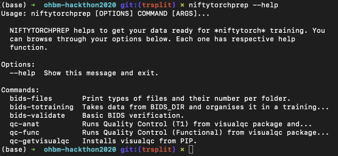

# niftytorchprep

BIDS to NiftyTorch: data preparation for deep learning.

## How it works?

`niftytorchprep` command-line interface tool helps you prepare your data for *niftytorch* training. It check if BIDS format of your data is correct and transforms it
into the format that is coherent with deep learning models training.

### Install

```
pip install git+https://github.com/NiftyTorch/ohbm-hackthon2020.git
```

Or download this repository and call:

```
python setup.py install
```

### Interface

```
$ niftytorchprep --help  
Usage: niftytorchprep [OPTIONS] COMMAND [ARGS]...

  NIFTYTORCHPREP helps to get your data ready for *niftytorch* training. You
  can browse through your options below. Each one has respective help
  function.

Options:
  --help  Show this message and exit.

Commands:
  bids-files       Print types of files and their number per folder.
  bids-totraining  Takes data from BIDS_DIR and organises it in a training...
  bids-validate    Basic BIDS verification.
  qc-anat          Runs Quality Control (T1) from visualqc package and...
  qc-func          Runs Quality Control (Functional) from visualqc package...
  qc-getvisualqc   Installs visualqc from PIP.
```

Here is an example that splits the data from various participants in BIDS format among:
training, test and validation folders:

```
niftytorchprep bids-totraining my_bids_data/ my_output_to_dl/ gender --test 0.2 --val 0.1
```

To get help for a specific option, call for example:

```
niftytorchprep bids-totraining --help
```

See it in action:



## Contributors

**Dominik Krzemiński** [@dokato](https://github.com/dokato)  
Cardiff University Brain Research Imaging Centre

**Sara Morsy** [@SaraMorsy](https://github.com/SaraMorsy)  
Faculty of Medicine, Tanta University, Egypt

**Kaori Lily Ito** [@kaoriito](https://github.com/kaoriito)  
Neural Plasticity & Neurorehabilitaiton Laboratory, University of Southern California

### History

This project has been initiated at [OHBM Hackthon 2020](https://github.com/ohbm/hackathon2020/issues/85).
